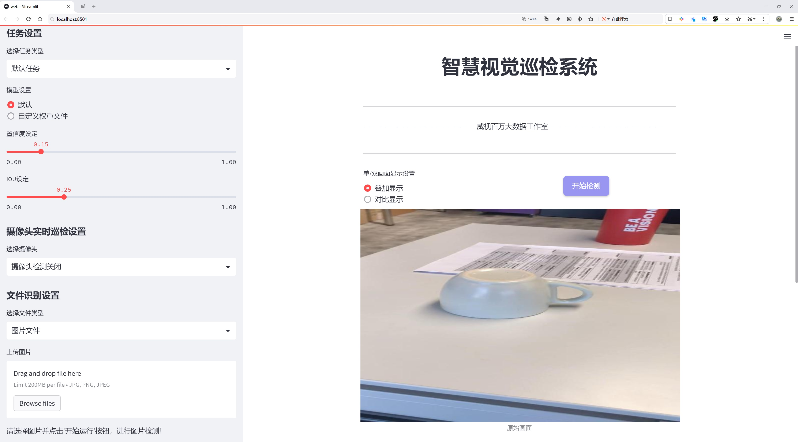
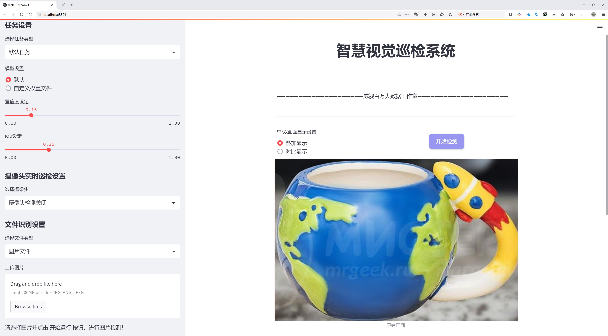
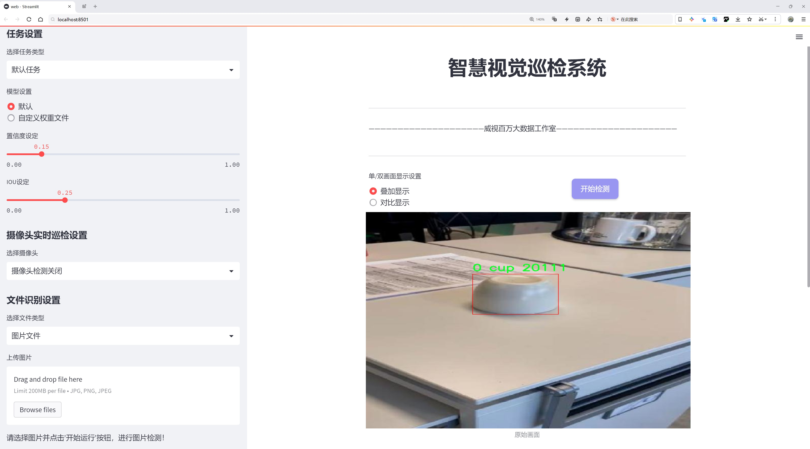
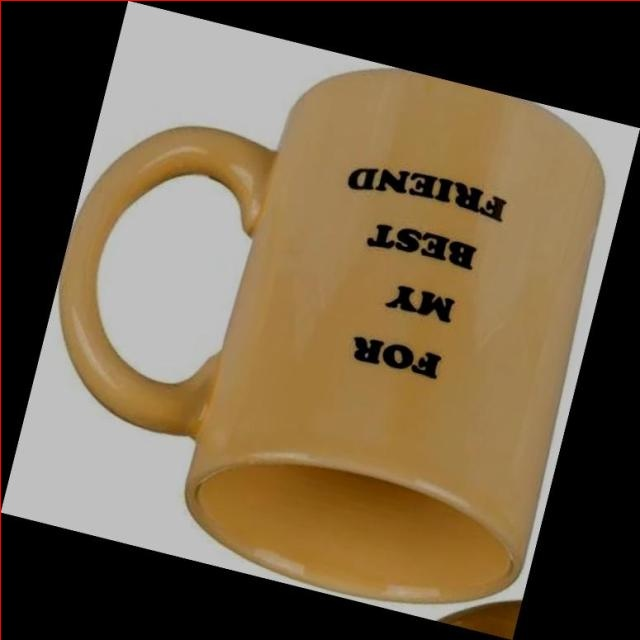
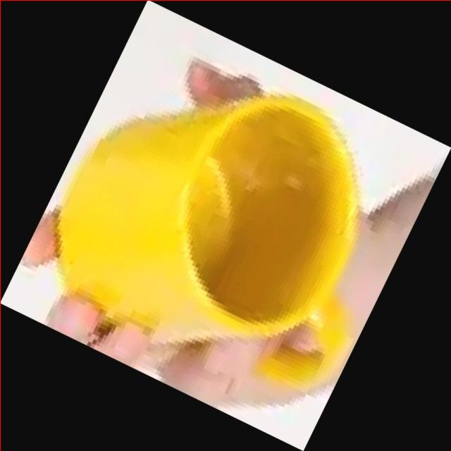
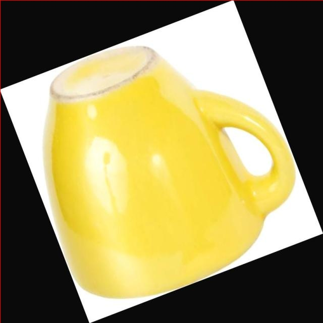
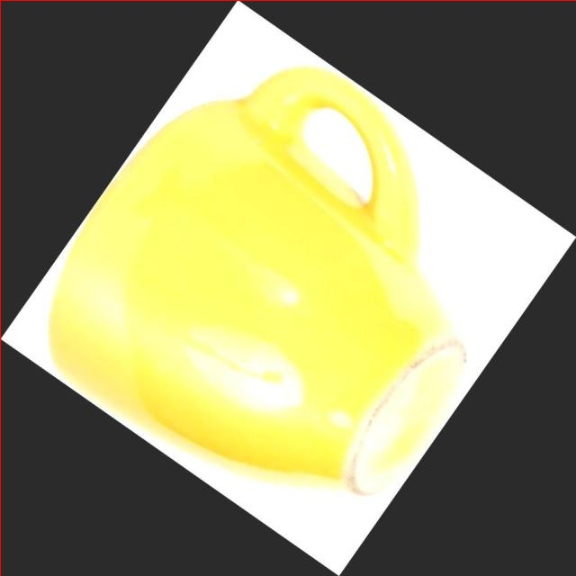

# 杯子检测检测系统源码分享
 # [一条龙教学YOLOV8标注好的数据集一键训练_70+全套改进创新点发刊_Web前端展示]

### 1.研究背景与意义

项目参考[AAAI Association for the Advancement of Artificial Intelligence](https://gitee.com/qunshansj/projects)

项目来源[AACV Association for the Advancement of Computer Vision](https://gitee.com/qunmasj/projects)

研究背景与意义

随着计算机视觉技术的迅猛发展，物体检测作为其重要分支之一，已广泛应用于各个领域，包括智能监控、自动驾驶、机器人视觉等。在这些应用中，杯子等日常物品的检测尤为重要，尤其是在智能家居和服务机器人等场景中，准确识别和定位杯子可以极大提升系统的智能化水平和用户体验。传统的物体检测方法在处理复杂背景、遮挡物以及不同光照条件下的物体时，往往面临着准确率低和鲁棒性差的问题。因此，基于深度学习的物体检测方法，尤其是YOLO（You Only Look Once）系列模型，因其高效性和实时性而受到广泛关注。

YOLOv8作为YOLO系列的最新版本，继承了前几代模型的优点，并在准确性和速度上进行了显著提升。其通过将物体检测任务转化为回归问题，使得模型能够在单次前向传播中同时预测多个边界框和类别概率，极大地提高了检测效率。然而，尽管YOLOv8在多种物体检测任务中表现出色，但在特定场景下的应用仍需进一步优化，尤其是在针对特定类别（如杯子）的检测任务中。

本研究旨在基于改进的YOLOv8模型，构建一个高效的杯子检测系统。所使用的数据集包含2300张图像，涵盖了两类目标：杯子及其变体。数据集的丰富性为模型的训练提供了良好的基础，但为了提高模型在实际应用中的表现，仍需对YOLOv8进行针对性的改进。这些改进可能包括优化网络结构、调整超参数、增强数据集等，以提高模型对杯子的检测精度和鲁棒性。

本研究的意义在于，通过构建一个高效的杯子检测系统，不仅能够推动物体检测技术在日常生活中的应用，还能为智能家居和服务机器人等领域提供技术支持。随着人们对智能化生活的追求，能够准确识别和处理日常物品的系统将成为未来发展的重要方向。此外，研究成果也将为后续的物体检测研究提供参考，推动YOLO系列模型在其他特定物体检测任务中的应用。

综上所述，基于改进YOLOv8的杯子检测系统的研究，不仅具有重要的理论价值，还具有广泛的实际应用前景。通过深入探讨和解决现有技术中的不足之处，本研究将为物体检测领域的发展贡献新的思路和方法，推动相关技术的进步与应用。

### 2.图片演示







##### 注意：由于此博客编辑较早，上面“2.图片演示”和“3.视频演示”展示的系统图片或者视频可能为老版本，新版本在老版本的基础上升级如下：（实际效果以升级的新版本为准）

  （1）适配了YOLOV8的“目标检测”模型和“实例分割”模型，通过加载相应的权重（.pt）文件即可自适应加载模型。

  （2）支持“图片识别”、“视频识别”、“摄像头实时识别”三种识别模式。

  （3）支持“图片识别”、“视频识别”、“摄像头实时识别”三种识别结果保存导出，解决手动导出（容易卡顿出现爆内存）存在的问题，识别完自动保存结果并导出到tempDir中。

  （4）支持Web前端系统中的标题、背景图等自定义修改，后面提供修改教程。

  另外本项目提供训练的数据集和训练教程,暂不提供权重文件（best.pt）,需要您按照教程进行训练后实现图片演示和Web前端界面演示的效果。

### 3.视频演示

[3.1 视频演示](https://www.bilibili.com/video/BV1GF4ZeVEvj/)

### 4.数据集信息展示

##### 4.1 本项目数据集详细数据（类别数＆类别名）

nc: 2
names: ['0 cup', 'Cup']


##### 4.2 本项目数据集信息介绍

数据集信息展示

在本研究中，我们采用了名为“Cup Detection”的数据集，以改进YOLOv8模型在杯子检测任务中的性能。该数据集专门设计用于训练和评估计算机视觉算法，尤其是在识别和定位杯子这一特定物体方面。数据集的类别数量为2，分别为“0 cup”和“Cup”。这种分类方式的设计意在区分不同状态下的杯子，其中“0 cup”表示没有杯子的背景或场景，而“Cup”则代表实际存在的杯子对象。这种明确的类别划分为模型的训练提供了清晰的目标，使得YOLOv8能够更有效地学习到杯子的特征和形态。

数据集的构建过程包括多样化的场景和背景，以确保模型在不同环境下的鲁棒性。数据集中包含了各种类型的杯子，包括陶瓷杯、塑料杯、玻璃杯等，这些不同材质和形状的杯子为模型提供了丰富的学习样本。此外，数据集还涵盖了不同的光照条件和拍摄角度，以模拟现实生活中可能遇到的各种情况。这种多样性不仅提高了模型的泛化能力，也使得其在实际应用中能够更好地适应不同的使用场景。

在数据预处理阶段，我们对图像进行了标准化处理，包括尺寸调整、数据增强等，以提高模型的训练效率和准确性。数据增强技术如随机裁剪、旋转、翻转等被广泛应用，以增加训练样本的多样性，从而帮助模型更好地学习到杯子的特征。这些处理步骤确保了数据集的高质量，使得YOLOv8在训练过程中能够获得更为有效的特征表示。

为了评估模型的性能，我们在数据集中划分了训练集和验证集。训练集用于模型的训练，而验证集则用于监测模型在未见数据上的表现。通过这种方式，我们能够及时调整模型的参数，避免过拟合现象的发生。数据集的标注工作由经验丰富的标注人员完成，确保每个图像中的杯子都被准确标记，提供了可靠的训练和验证基础。

总的来说，“Cup Detection”数据集为YOLOv8的杯子检测系统提供了一个全面而多样化的训练基础。通过对数据集的精心设计和处理，我们期望能够显著提升模型在杯子检测任务中的准确性和效率。随着深度学习技术的不断进步，我们相信这一数据集将为相关研究提供重要的支持，推动杯子检测领域的发展。未来，我们还计划进一步扩展数据集的规模和类别，以涵盖更多种类的杯子和相关物体，从而提升模型的适用性和实用性。










### 5.全套项目环境部署视频教程（零基础手把手教学）

[5.1 环境部署教程链接（零基础手把手教学）](https://www.ixigua.com/7404473917358506534?logTag=c807d0cbc21c0ef59de5)


[5.2 安装Python虚拟环境创建和依赖库安装视频教程链接（零基础手把手教学）](https://www.ixigua.com/7404474678003106304?logTag=1f1041108cd1f708b01a)

### 6.手把手YOLOV8训练视频教程（零基础小白有手就能学会）

[6.1 手把手YOLOV8训练视频教程（零基础小白有手就能学会）](https://www.ixigua.com/7404477157818401292?logTag=d31a2dfd1983c9668658)

### 7.70+种全套YOLOV8创新点代码加载调参视频教程（一键加载写好的改进模型的配置文件）

[7.1 70+种全套YOLOV8创新点代码加载调参视频教程（一键加载写好的改进模型的配置文件）](https://www.ixigua.com/7404478314661806627?logTag=29066f8288e3f4eea3a4)

### 8.70+种全套YOLOV8创新点原理讲解（非科班也可以轻松写刊发刊，V10版本正在科研待更新）

由于篇幅限制，每个创新点的具体原理讲解就不一一展开，具体见下列网址中的创新点对应子项目的技术原理博客网址【Blog】：


[8.1 70+种全套YOLOV8创新点原理讲解链接](https://gitee.com/qunmasj/good)

### 9.系统功能展示（检测对象为举例，实际内容以本项目数据集为准）

图9.1.系统支持检测结果表格显示

  图9.2.系统支持置信度和IOU阈值手动调节

  图9.3.系统支持自定义加载权重文件best.pt(需要你通过步骤5中训练获得)

  图9.4.系统支持摄像头实时识别

  图9.5.系统支持图片识别

  图9.6.系统支持视频识别

  图9.7.系统支持识别结果文件自动保存

  图9.8.系统支持Excel导出检测结果数据


### 10.原始YOLOV8算法原理

原始YOLOv8算法原理

YOLOv8作为YOLO系列中的最新一员，继承并优化了前几代模型的核心思想，旨在提供更高效的目标检测解决方案。与以往的anchor-based检测方法相比，YOLOv8引入了anchor-free的设计理念，这一转变不仅提升了检测精度，还显著加快了检测速度，使得该算法在实时应用场景中表现出色。YOLOv8的架构主要由输入端、主干网络、Neck端和输出端四个模块组成，各个模块相辅相成，共同构成了这一高效的目标检测系统。

在输入端，YOLOv8采用了一系列数据增强技术，包括Mosaic数据增强、自适应图片缩放和灰度填充等，以提升模型的泛化能力和鲁棒性。这些预处理步骤确保了输入图像的多样性，使得模型能够在不同的环境下进行有效的学习和检测。主干网络则是YOLOv8的核心部分，采用了一系列卷积层和反卷积层，通过C2模块、残差连接和瓶颈结构等技术，提取出图像中的重要特征。特别是C2f模块的引入，使得特征提取过程更加高效，能够更好地捕捉图像中的细节信息。

Neck端的设计则是YOLOv8的一大亮点。该部分基于路径聚合网络（PAN）结构，通过上采样和下采样的方式，对来自主干网络的不同尺度特征图进行融合。这种多尺度特征融合技术使得YOLOv8能够更好地处理不同大小的目标，增强了模型对小目标的检测能力。输出端采用了decoupled head结构，实现了分类和回归过程的解耦，这一设计使得模型在进行目标检测时，能够更加灵活地处理正负样本的匹配和损失计算。

YOLOv8的损失计算策略也进行了优化，采用了BCE（binary cross-entropy）计算分类损失，同时使用DFL（distribution focal loss）和CIoU（complete intersection over union）损失函数计算回归损失。这种新的损失策略使得YOLOv8在目标检测任务中，能够更准确地评估模型的性能，从而提升检测精度。

尽管YOLOv8在多个方面进行了改进，但在复杂水面环境下的应用仍然面临挑战。由于小目标漂浮物的特征复杂且背景多样，YOLOv8在这些场景下的定位精度和目标感知能力仍显不足。因此，针对这些问题，研究者们提出了YOLOv8-WSSOD算法，以进一步提升YOLOv8在特定应用场景下的表现。

YOLOv8-WSSOD算法的改进主要体现在几个方面。首先，为了减轻主干网络下采样过程中的噪声影响，YOLOv8-WSSOD引入了捕获远程依赖的思想，采用了BiFormer双层路由注意力机制构建C2fBF模块。这一模块的设计旨在保留特征提取过程中更细粒度的上下文信息，从而提高模型对复杂背景下小目标的感知能力。其次，针对小目标漏检的问题，YOLOv8-WSSOD添加了一个更小的检测头，以提升网络对小目标的检测能力。此外，在Neck端引入GSConv和Slim-neck技术，旨在保持检测精度的同时降低计算量，使得模型在处理复杂场景时更加高效。

最后，YOLOv8-WSSOD还使用了MPDIoU损失函数替换了CIoU损失函数，以提高模型的泛化能力和精准度。这一改进使得YOLOv8-WSSOD在复杂环境下的表现更加出色，能够有效地应对小目标的检测挑战。

总的来说，YOLOv8算法通过一系列创新设计和优化，成功地在目标检测领域树立了新的标杆。其anchor-free的设计理念、先进的多尺度特征融合技术以及灵活的损失计算策略，使得YOLOv8在各类应用场景中展现出强大的性能。尽管在特定环境下仍存在一些不足，但通过针对性的改进，YOLOv8及其衍生版本如YOLOv8-WSSOD，展现了极大的潜力，为未来的目标检测研究提供了新的方向。随着技术的不断进步，YOLOv8系列算法无疑将在更广泛的应用领域中发挥重要作用。


### 11.项目核心源码讲解（再也不用担心看不懂代码逻辑）

#### 11.1 ui.py

以下是代码的核心部分，并附上详细的中文注释：

```python
import sys
import subprocess

def run_script(script_path):
    """
    使用当前 Python 环境运行指定的脚本。

    Args:
        script_path (str): 要运行的脚本路径

    Returns:
        None
    """
    # 获取当前 Python 解释器的路径
    python_path = sys.executable

    # 构建运行命令，使用 streamlit 运行指定的脚本
    command = f'"{python_path}" -m streamlit run "{script_path}"'

    # 执行命令
    result = subprocess.run(command, shell=True)
    
    # 检查命令执行结果，如果返回码不为0，则表示执行出错
    if result.returncode != 0:
        print("脚本运行出错。")

# 主程序入口
if __name__ == "__main__":
    # 指定要运行的脚本路径
    script_path = "web.py"  # 假设脚本在当前目录下

    # 调用函数运行脚本
    run_script(script_path)
```

### 代码分析与注释：

1. **导入模块**：
   - `import sys`: 导入系统相关的模块，用于获取当前 Python 解释器的路径。
   - `import subprocess`: 导入子进程模块，用于在 Python 中执行外部命令。

2. **定义 `run_script` 函数**：
   - 该函数接收一个参数 `script_path`，表示要运行的 Python 脚本的路径。
   - 使用 `sys.executable` 获取当前 Python 解释器的路径，以确保使用正确的 Python 环境来运行脚本。
   - 构建一个命令字符串，使用 `streamlit` 模块运行指定的脚本。
   - 使用 `subprocess.run` 执行构建的命令，并将 `shell=True` 作为参数，允许在 shell 中执行命令。
   - 检查命令的返回码，如果返回码不为0，表示脚本运行出错，打印错误信息。

3. **主程序入口**：
   - 使用 `if __name__ == "__main__":` 确保只有在直接运行该脚本时才会执行以下代码。
   - 指定要运行的脚本路径（这里假设脚本名为 `web.py`）。
   - 调用 `run_script` 函数来执行指定的脚本。

### 总结：
这段代码的核心功能是使用当前 Python 环境运行一个指定的脚本，并在运行出错时提供反馈。

这个文件名为 `ui.py`，它的主要功能是通过当前的 Python 环境来运行一个指定的脚本，具体是一个名为 `web.py` 的文件。文件中首先导入了必要的模块，包括 `sys`、`os` 和 `subprocess`，以及一个自定义的函数 `abs_path`，该函数用于获取文件的绝对路径。

在 `run_script` 函数中，首先获取当前 Python 解释器的路径，这通过 `sys.executable` 实现。接着，构建一个命令字符串，该命令使用 `streamlit` 来运行指定的脚本。这里使用了 `subprocess.run` 方法来执行这个命令，并且设置 `shell=True` 以便在 shell 环境中运行命令。

在执行命令后，函数会检查返回的状态码。如果状态码不为零，表示脚本运行过程中出现了错误，此时会打印出“脚本运行出错”的提示信息。

在文件的最后部分，使用 `if __name__ == "__main__":` 来确保只有在直接运行该文件时才会执行后面的代码。在这里，指定了要运行的脚本路径 `web.py`，并调用 `run_script` 函数来执行这个脚本。

总体来说，这个文件的功能是封装了一个简单的命令行工具，方便用户通过 Python 环境来启动一个 Streamlit 应用。

#### 11.2 70+种YOLOv8算法改进源码大全和调试加载训练教程（非必要）\ultralytics\utils\autobatch.py

以下是经过简化和注释的核心代码部分：

```python
import numpy as np
import torch
from ultralytics.utils import LOGGER, colorstr
from ultralytics.utils.torch_utils import profile

def check_train_batch_size(model, imgsz=640, amp=True):
    """
    检查YOLO模型的训练批量大小。

    参数:
        model (torch.nn.Module): 要检查批量大小的YOLO模型。
        imgsz (int): 用于训练的图像大小。
        amp (bool): 如果为True，则使用自动混合精度（AMP）进行训练。

    返回:
        (int): 使用autobatch()函数计算的最佳批量大小。
    """
    with torch.cuda.amp.autocast(amp):
        return autobatch(model.train(), imgsz)  # 计算最佳批量大小

def autobatch(model, imgsz=640, fraction=0.60, batch_size=16):
    """
    自动估计最佳YOLO批量大小，以使用可用CUDA内存的一部分。

    参数:
        model (torch.nn.Module): 要计算批量大小的YOLO模型。
        imgsz (int): 用作YOLO模型输入的图像大小，默认为640。
        fraction (float): 要使用的可用CUDA内存的比例，默认为0.60。
        batch_size (int): 如果检测到错误，则使用的默认批量大小，默认为16。

    返回:
        (int): 最佳批量大小。
    """
    # 检查设备
    prefix = colorstr('AutoBatch: ')
    LOGGER.info(f'{prefix}计算图像大小为{imgsz}的最佳批量大小')
    device = next(model.parameters()).device  # 获取模型所在设备
    if device.type == 'cpu':
        LOGGER.info(f'{prefix}未检测到CUDA，使用默认CPU批量大小 {batch_size}')
        return batch_size

    # 检查CUDA内存
    gb = 1 << 30  # 字节转换为GiB (1024 ** 3)
    properties = torch.cuda.get_device_properties(device)  # 获取设备属性
    total_memory = properties.total_memory / gb  # 总内存（GiB）
    reserved_memory = torch.cuda.memory_reserved(device) / gb  # 保留内存（GiB）
    allocated_memory = torch.cuda.memory_allocated(device) / gb  # 已分配内存（GiB）
    free_memory = total_memory - (reserved_memory + allocated_memory)  # 可用内存（GiB）
    
    LOGGER.info(f'{prefix}{device} ({properties.name}) {total_memory:.2f}G 总, {reserved_memory:.2f}G 保留, {allocated_memory:.2f}G 已分配, {free_memory:.2f}G 可用')

    # 评估批量大小
    batch_sizes = [1, 2, 4, 8, 16]  # 可能的批量大小
    try:
        img = [torch.empty(b, 3, imgsz, imgsz) for b in batch_sizes]  # 创建空张量以模拟输入
        results = profile(img, model, n=3, device=device)  # 评估每个批量大小的内存使用情况

        # 拟合线性模型以估计最佳批量大小
        memory_usage = [x[2] for x in results if x]  # 提取内存使用情况
        p = np.polyfit(batch_sizes[:len(memory_usage)], memory_usage, deg=1)  # 一次多项式拟合
        optimal_batch_size = int((free_memory * fraction - p[1]) / p[0])  # 计算最佳批量大小

        # 检查是否有失败的批量大小
        if None in results:
            i = results.index(None)  # 找到第一个失败的索引
            if optimal_batch_size >= batch_sizes[i]:  # 如果最佳批量大小在失败点之后
                optimal_batch_size = batch_sizes[max(i - 1, 0)]  # 选择安全的前一个点

        # 确保最佳批量大小在安全范围内
        if optimal_batch_size < 1 or optimal_batch_size > 1024:
            optimal_batch_size = batch_size
            LOGGER.info(f'{prefix}警告 ⚠️ 检测到CUDA异常，使用默认批量大小 {batch_size}.')

        # 记录实际使用的批量大小
        fraction_used = (np.polyval(p, optimal_batch_size) + reserved_memory + allocated_memory) / total_memory
        LOGGER.info(f'{prefix}使用批量大小 {optimal_batch_size}，{total_memory * fraction_used:.2f}G/{total_memory:.2f}G ({fraction_used * 100:.0f}%) ✅')
        return optimal_batch_size
    except Exception as e:
        LOGGER.warning(f'{prefix}警告 ⚠️ 检测到错误: {e}, 使用默认批量大小 {batch_size}.')
        return batch_size
```

### 代码说明：
1. **check_train_batch_size**: 该函数用于检查给定YOLO模型的最佳训练批量大小。它使用`autobatch`函数来计算最佳批量大小，并支持自动混合精度（AMP）。

2. **autobatch**: 该函数自动估计最佳批量大小，以使用可用CUDA内存的一部分。它首先检查设备类型，如果是CPU，则返回默认批量大小。接着，它获取CUDA设备的内存信息，并尝试评估不同批量大小的内存使用情况。最后，通过线性拟合计算最佳批量大小，并确保其在安全范围内。

3. **内存管理**: 代码中使用了CUDA内存的总量、保留量和已分配量来计算可用内存，并通过这些信息来决定最佳的批量大小。

4. **异常处理**: 在评估过程中，如果发生任何异常，代码会记录警告并返回默认批量大小。

这个程序文件是用于估算YOLO模型在PyTorch中最佳批处理大小的工具，目的是为了在训练过程中合理利用可用的CUDA内存。文件中定义了几个函数，主要包括`check_train_batch_size`和`autobatch`。

`check_train_batch_size`函数接收一个YOLO模型、图像大小和一个布尔值（表示是否使用自动混合精度）作为参数。它通过调用`autobatch`函数来计算最佳的批处理大小。在执行过程中，使用了PyTorch的自动混合精度功能，以提高训练效率。

`autobatch`函数是核心功能，它自动估算最佳的批处理大小。函数首先检查模型所在的设备，如果设备是CPU，则返回默认的批处理大小。如果使用的是CUDA设备，函数会获取CUDA设备的内存信息，包括总内存、已保留内存和已分配内存，从而计算出可用的自由内存。

接下来，函数会对几个预设的批处理大小（1, 2, 4, 8, 16）进行性能分析，创建相应大小的空张量，并调用`profile`函数来测量每个批处理大小下的内存使用情况。通过对这些结果进行线性拟合，函数可以估算出一个最佳的批处理大小。

在估算过程中，如果发现某些批处理大小导致错误，函数会选择一个安全的批处理大小作为替代。此外，函数还会检查计算出的批处理大小是否在合理范围内（1到1024之间），如果不在这个范围内，则使用默认的批处理大小。

最后，函数会记录使用的批处理大小和内存使用情况，并返回最佳的批处理大小。如果在执行过程中发生异常，函数会捕获并记录警告信息，并返回默认的批处理大小。

整体而言，这个文件的功能是为了帮助用户在训练YOLO模型时，自动计算出合适的批处理大小，以优化内存使用和训练效率。

#### 11.3 70+种YOLOv8算法改进源码大全和调试加载训练教程（非必要）\ultralytics\utils\instance.py

以下是经过简化和注释的核心代码部分，主要集中在 `Bboxes` 和 `Instances` 类的实现上。

```python
import numpy as np

class Bboxes:
    """
    处理边界框的类，支持多种格式（'xyxy', 'xywh', 'ltwh'）。
    """

    def __init__(self, bboxes, format='xyxy') -> None:
        """
        初始化 Bboxes 类，接收边界框数据和格式。
        
        参数:
            bboxes (numpy.ndarray): 边界框数据，形状为 [N, 4]。
            format (str): 边界框格式，默认为 'xyxy'。
        """
        # 验证格式是否有效
        assert format in ['xyxy', 'xywh', 'ltwh'], f'无效的边界框格式: {format}'
        # 确保 bboxes 是二维数组
        bboxes = bboxes[None, :] if bboxes.ndim == 1 else bboxes
        assert bboxes.ndim == 2 and bboxes.shape[1] == 4
        self.bboxes = bboxes  # 存储边界框
        self.format = format  # 存储格式

    def convert(self, format):
        """将边界框格式转换为指定格式。"""
        assert format in ['xyxy', 'xywh', 'ltwh'], f'无效的边界框格式: {format}'
        if self.format == format:
            return  # 如果格式相同，则不进行转换
        # 根据当前格式和目标格式选择转换函数
        func = self._get_conversion_function(format)
        self.bboxes = func(self.bboxes)  # 执行转换
        self.format = format  # 更新格式

    def _get_conversion_function(self, format):
        """根据当前格式和目标格式返回相应的转换函数。"""
        if self.format == 'xyxy':
            return xyxy2xywh if format == 'xywh' else xyxy2ltwh
        elif self.format == 'xywh':
            return xywh2xyxy if format == 'xyxy' else xywh2ltwh
        else:
            return ltwh2xyxy if format == 'xyxy' else ltwh2xywh

    def areas(self):
        """计算并返回每个边界框的面积。"""
        self.convert('xyxy')  # 转换为 'xyxy' 格式以计算面积
        return (self.bboxes[:, 2] - self.bboxes[:, 0]) * (self.bboxes[:, 3] - self.bboxes[:, 1])  # 宽 * 高

class Instances:
    """
    存储图像中检测到的对象的边界框、分段和关键点的容器。
    """

    def __init__(self, bboxes, segments=None, keypoints=None, bbox_format='xywh', normalized=True) -> None:
        """
        初始化 Instances 类，接收边界框、分段和关键点数据。
        
        参数:
            bboxes (numpy.ndarray): 边界框数据，形状为 [N, 4]。
            segments (list | ndarray): 对象分段数据，默认为 None。
            keypoints (ndarray): 关键点数据，形状为 [N, 17, 3]，默认为 None。
            bbox_format (str): 边界框格式，默认为 'xywh'。
            normalized (bool): 是否归一化，默认为 True。
        """
        self._bboxes = Bboxes(bboxes=bboxes, format=bbox_format)  # 初始化边界框
        self.keypoints = keypoints  # 存储关键点
        self.normalized = normalized  # 存储归一化标志
        self.segments = self._process_segments(segments)  # 处理分段数据

    def _process_segments(self, segments):
        """处理分段数据，确保其形状正确。"""
        if segments is None:
            return np.zeros((0, 1000, 2), dtype=np.float32)  # 如果没有分段，返回空数组
        segments = resample_segments(segments)  # 重新采样分段
        return np.stack(segments, axis=0)  # 将分段数据堆叠成数组

    def convert_bbox(self, format):
        """转换边界框格式。"""
        self._bboxes.convert(format=format)

    @property
    def bbox_areas(self):
        """计算并返回边界框的面积。"""
        return self._bboxes.areas()

    def scale(self, scale_w, scale_h, bbox_only=False):
        """缩放边界框、分段和关键点的坐标。"""
        self._bboxes.mul(scale=(scale_w, scale_h, scale_w, scale_h))  # 缩放边界框
        if not bbox_only:
            self.segments[..., 0] *= scale_w  # 缩放分段
            self.segments[..., 1] *= scale_h  # 缩放分段
            if self.keypoints is not None:
                self.keypoints[..., 0] *= scale_w  # 缩放关键点
                self.keypoints[..., 1] *= scale_h  # 缩放关键点

    def __getitem__(self, index) -> 'Instances':
        """
        使用索引获取特定实例或一组实例。
        
        参数:
            index (int, slice, or np.ndarray): 索引、切片或布尔数组，用于选择所需的实例。
        
        返回:
            Instances: 包含所选边界框、分段和关键点的新 Instances 对象。
        """
        segments = self.segments[index] if len(self.segments) else self.segments
        keypoints = self.keypoints[index] if self.keypoints is not None else None
        bboxes = self.bboxes[index]
        bbox_format = self._bboxes.format
        return Instances(
            bboxes=bboxes,
            segments=segments,
            keypoints=keypoints,
            bbox_format=bbox_format,
            normalized=self.normalized,
        )

    @property
    def bboxes(self):
        """返回边界框数据。"""
        return self._bboxes.bboxes
```

### 代码说明：
1. **Bboxes 类**：用于处理边界框的类，支持不同的格式（'xyxy', 'xywh', 'ltwh'）。提供了初始化、格式转换、面积计算等功能。
2. **Instances 类**：用于存储图像中检测到的对象的边界框、分段和关键点。支持缩放、格式转换和索引操作。
3. **方法和属性**：每个类都定义了多个方法和属性，以便于对边界框和实例的操作，如计算面积、缩放、格式转换等。

这个程序文件是一个用于处理边界框（bounding boxes）的类库，主要用于计算机视觉任务中，例如目标检测。文件中定义了两个主要的类：`Bboxes`和`Instances`，它们分别用于处理边界框和包含边界框、分割和关键点的实例。

首先，`Bboxes`类用于管理边界框，支持多种格式，包括`xyxy`（左上角和右下角坐标）、`xywh`（中心坐标和宽高）以及`ltwh`（左上角坐标和宽高）。在初始化时，`Bboxes`类会检查输入的边界框格式是否有效，并确保输入的边界框数据是一个二维的NumPy数组。该类提供了多种方法，例如`convert`用于转换边界框格式，`areas`用于计算边界框的面积，`mul`和`add`用于缩放和偏移边界框的坐标。

`Instances`类则是一个更复杂的容器，除了包含边界框外，还可以存储分割信息和关键点。该类的构造函数接收边界框、分割和关键点数据，并将其存储为内部属性。`Instances`类提供了多种方法来处理这些数据，包括坐标的归一化和反归一化、添加填充、翻转坐标、裁剪到图像边界等。它还可以通过索引操作获取特定的实例或实例集合。

此外，两个类都实现了拼接功能，可以将多个`Bboxes`或`Instances`对象合并为一个新的对象。这对于处理批量数据时非常有用。

总的来说，这个文件提供了一套完整的工具，用于处理和操作边界框及其相关信息，适用于YOLO等目标检测算法的实现。

#### 11.4 code\ultralytics\models\nas\__init__.py

以下是代码中最核心的部分，并附上详细的中文注释：

```python
# 导入必要的模块和类
from .model import NAS  # 从当前包的model模块中导入NAS类
from .predict import NASPredictor  # 从当前包的predict模块中导入NASPredictor类
from .val import NASValidator  # 从当前包的val模块中导入NASValidator类

# 定义模块的公开接口
__all__ = "NASPredictor", "NASValidator", "NAS"  # 指定当使用from module import *时，公开的类和函数
```

### 注释说明：
1. **导入模块**：
   - `from .model import NAS`：从当前包的`model`模块中导入`NAS`类，`NAS`可能是一个神经网络架构的定义。
   - `from .predict import NASPredictor`：从当前包的`predict`模块中导入`NASPredictor`类，`NASPredictor`可能用于进行预测的功能。
   - `from .val import NASValidator`：从当前包的`val`模块中导入`NASValidator`类，`NASValidator`可能用于验证模型性能的功能。

2. **定义公开接口**：
   - `__all__`是一个特殊变量，用于定义模块的公共接口。当使用`from module import *`时，只有在`__all__`中列出的名称会被导入。这里列出了`NASPredictor`、`NASValidator`和`NAS`，表示这些是模块的主要功能组件。

这个程序文件是一个Python模块的初始化文件，通常用于定义模块的公共接口。在这个文件中，首先有一个注释，表明该代码属于Ultralytics YOLO项目，并且使用AGPL-3.0许可证。接下来，文件通过相对导入的方式引入了三个组件：`NAS`、`NASPredictor`和`NASValidator`，这些组件分别来自于同一目录下的`model`、`predict`和`val`模块。

`NAS`可能是一个与神经架构搜索（Neural Architecture Search）相关的模型类，而`NASPredictor`和`NASValidator`则分别是用于进行预测和验证的类。这种结构使得模块在被导入时，可以直接使用这些类，而不需要用户去了解内部的实现细节。

最后，`__all__`变量定义了模块的公共接口，包含了`NASPredictor`、`NASValidator`和`NAS`这三个名称。这意味着，当使用`from module import *`的方式导入该模块时，只会导入这三个指定的名称，从而控制了模块的可见性，避免不必要的名称冲突和隐藏实现细节。整体来看，这个文件的主要作用是组织和简化模块的使用，使得用户能够方便地访问所需的功能。

#### 11.5 70+种YOLOv8算法改进源码大全和调试加载训练教程（非必要）\ultralytics\utils\callbacks\mlflow.py

以下是代码中最核心的部分，并附上详细的中文注释：

```python
from ultralytics.utils import LOGGER, RUNS_DIR, SETTINGS, TESTS_RUNNING, colorstr

try:
    import os

    # 确保在测试环境中不记录日志
    assert not TESTS_RUNNING or 'test_mlflow' in os.environ.get('PYTEST_CURRENT_TEST', '')
    # 确保MLflow集成已启用
    assert SETTINGS['mlflow'] is True  
    import mlflow

    # 确保mlflow包已正确导入
    assert hasattr(mlflow, '__version__')  
    from pathlib import Path
    PREFIX = colorstr('MLflow: ')  # 设置日志前缀

except (ImportError, AssertionError):
    mlflow = None  # 如果导入失败，则mlflow为None


def on_pretrain_routine_end(trainer):
    """
    在预训练例程结束时，将训练参数记录到MLflow。

    该函数根据环境变量和训练器参数设置MLflow日志。它设置跟踪URI、实验名称和运行名称，
    然后在未激活的情况下启动MLflow运行。最后记录训练器的参数。

    参数:
        trainer (ultralytics.engine.trainer.BaseTrainer): 包含要记录的参数和参数的训练对象。

    全局变量:
        mlflow: 用于记录的mlflow模块。

    环境变量:
        MLFLOW_TRACKING_URI: MLflow跟踪的URI。如果未设置，默认为'runs/mlflow'。
        MLFLOW_EXPERIMENT_NAME: MLflow实验的名称。如果未设置，默认为trainer.args.project。
        MLFLOW_RUN: MLflow运行的名称。如果未设置，默认为trainer.args.name。
    """
    global mlflow

    # 获取跟踪URI，默认为'runs/mlflow'
    uri = os.environ.get('MLFLOW_TRACKING_URI') or str(RUNS_DIR / 'mlflow')
    LOGGER.debug(f'{PREFIX} tracking uri: {uri}')
    mlflow.set_tracking_uri(uri)

    # 设置实验和运行名称
    experiment_name = os.environ.get('MLFLOW_EXPERIMENT_NAME') or trainer.args.project or '/Shared/YOLOv8'
    run_name = os.environ.get('MLFLOW_RUN') or trainer.args.name
    mlflow.set_experiment(experiment_name)

    mlflow.autolog()  # 启用自动日志记录
    try:
        # 获取当前活动的运行或启动新的运行
        active_run = mlflow.active_run() or mlflow.start_run(run_name=run_name)
        LOGGER.info(f'{PREFIX}logging run_id({active_run.info.run_id}) to {uri}')
        if Path(uri).is_dir():
            LOGGER.info(f"{PREFIX}view at http://127.0.0.1:5000 with 'mlflow server --backend-store-uri {uri}'")
        LOGGER.info(f"{PREFIX}disable with 'yolo settings mlflow=False'")
        mlflow.log_params(dict(trainer.args))  # 记录训练参数
    except Exception as e:
        LOGGER.warning(f'{PREFIX}WARNING ⚠️ Failed to initialize: {e}\n'
                       f'{PREFIX}WARNING ⚠️ Not tracking this run')


def on_fit_epoch_end(trainer):
    """在每个训练周期结束时，将训练指标记录到MLflow。"""
    if mlflow:
        # 清理指标名称并将其记录到MLflow
        sanitized_metrics = {k.replace('(', '').replace(')', ''): float(v) for k, v in trainer.metrics.items()}
        mlflow.log_metrics(metrics=sanitized_metrics, step=trainer.epoch)


def on_train_end(trainer):
    """在训练结束时记录模型工件。"""
    if mlflow:
        # 记录最佳模型的文件
        mlflow.log_artifact(str(trainer.best.parent))  
        # 记录保存目录中的所有其他文件
        for f in trainer.save_dir.glob('*'):
            if f.suffix in {'.png', '.jpg', '.csv', '.pt', '.yaml'}:
                mlflow.log_artifact(str(f))

        mlflow.end_run()  # 结束当前的MLflow运行
        LOGGER.info(f'{PREFIX}results logged to {mlflow.get_tracking_uri()}\n'
                    f"{PREFIX}disable with 'yolo settings mlflow=False'")


# 定义回调函数字典，如果mlflow未导入则为空
callbacks = {
    'on_pretrain_routine_end': on_pretrain_routine_end,
    'on_fit_epoch_end': on_fit_epoch_end,
    'on_train_end': on_train_end} if mlflow else {}
```

### 代码核心部分解释：
1. **导入必要的模块**：导入了`ultralytics`库中的一些工具和`mlflow`库。
2. **环境变量检查**：确保在测试环境中不记录日志，并检查MLflow集成是否启用。
3. **日志记录函数**：
   - `on_pretrain_routine_end`：在预训练结束时记录训练参数和设置MLflow运行。
   - `on_fit_epoch_end`：在每个训练周期结束时记录训练指标。
   - `on_train_end`：在训练结束时记录模型的工件（如权重文件和其他相关文件）。
4. **回调函数字典**：根据是否成功导入`mlflow`来定义回调函数。

这个程序文件是用于在Ultralytics YOLO（一个目标检测模型）中集成MLflow的日志记录功能。MLflow是一个开源平台，用于管理机器学习实验，能够记录模型的参数、指标和模型工件。文件中包含了一些重要的功能和设置，下面对其进行详细说明。

首先，文件开头的文档字符串介绍了MLflow在Ultralytics YOLO中的作用，说明了如何设置跟踪URI、项目名称和运行名称，以及如何启动本地的MLflow服务器。用户可以通过环境变量或参数来配置这些设置。文档还提供了如何终止正在运行的MLflow服务器的命令。

接下来，文件导入了一些必要的模块，包括Ultralytics的日志记录器、运行目录、设置和颜色字符串。然后，尝试导入os模块，并进行了一些断言检查，以确保在测试运行时不记录日志，并验证MLflow集成是否启用。如果MLflow模块未成功导入或版本不正确，mlflow变量将被设置为None。

文件定义了三个主要的回调函数，分别在不同的训练阶段执行日志记录。第一个函数`on_pretrain_routine_end`在预训练结束时调用，它设置MLflow的跟踪URI、实验名称和运行名称，并开始一个新的MLflow运行。它还会记录训练器的参数。如果在初始化过程中出现异常，会记录警告信息。

第二个函数`on_fit_epoch_end`在每个训练周期结束时调用，用于记录训练指标。它会将训练器的指标进行清理（去掉括号），并将其记录到MLflow中。

第三个函数`on_train_end`在训练结束时调用，负责记录模型工件。它会记录最佳模型和最后模型的权重文件，以及保存目录中的其他文件（如图像、CSV、YAML等）。最后，它结束当前的MLflow运行，并记录结果的URI。

最后，文件创建了一个回调字典，包含了三个回调函数，如果mlflow模块可用，则将这些函数注册到字典中。这使得在训练过程中可以自动调用这些函数进行日志记录。

总的来说，这个文件为Ultralytics YOLO提供了一个方便的接口，用于在训练过程中记录和管理实验数据，帮助用户更好地跟踪和分析模型的性能。

#### 11.6 train.py

以下是代码中最核心的部分，并附上详细的中文注释：

```python
class DetectionTrainer(BaseTrainer):
    """
    DetectionTrainer类用于基于检测模型进行训练，继承自BaseTrainer类。
    """

    def build_dataset(self, img_path, mode="train", batch=None):
        """
        构建YOLO数据集。

        参数:
            img_path (str): 包含图像的文件夹路径。
            mode (str): 模式，可以是'train'或'val'，用户可以为每种模式自定义不同的增强。
            batch (int, optional): 批次大小，仅用于'rect'模式。默认为None。
        """
        gs = max(int(de_parallel(self.model).stride.max() if self.model else 0), 32)
        return build_yolo_dataset(self.args, img_path, batch, self.data, mode=mode, rect=mode == "val", stride=gs)

    def get_dataloader(self, dataset_path, batch_size=16, rank=0, mode="train"):
        """构造并返回数据加载器。"""
        assert mode in ["train", "val"]  # 确保模式有效
        with torch_distributed_zero_first(rank):  # 仅在DDP情况下初始化数据集
            dataset = self.build_dataset(dataset_path, mode, batch_size)
        shuffle = mode == "train"  # 训练模式下打乱数据
        if getattr(dataset, "rect", False) and shuffle:
            LOGGER.warning("WARNING ⚠️ 'rect=True'与DataLoader的shuffle不兼容，设置shuffle=False")
            shuffle = False
        workers = self.args.workers if mode == "train" else self.args.workers * 2  # 设置工作线程数
        return build_dataloader(dataset, batch_size, workers, shuffle, rank)  # 返回数据加载器

    def preprocess_batch(self, batch):
        """对一批图像进行预处理，包括缩放和转换为浮点数。"""
        batch["img"] = batch["img"].to(self.device, non_blocking=True).float() / 255  # 将图像转换为浮点数并归一化
        if self.args.multi_scale:  # 如果启用多尺度
            imgs = batch["img"]
            sz = (
                random.randrange(self.args.imgsz * 0.5, self.args.imgsz * 1.5 + self.stride)
                // self.stride
                * self.stride
            )  # 随机选择图像大小
            sf = sz / max(imgs.shape[2:])  # 计算缩放因子
            if sf != 1:
                ns = [
                    math.ceil(x * sf / self.stride) * self.stride for x in imgs.shape[2:]
                ]  # 计算新的形状
                imgs = nn.functional.interpolate(imgs, size=ns, mode="bilinear", align_corners=False)  # 进行插值缩放
            batch["img"] = imgs  # 更新图像
        return batch

    def set_model_attributes(self):
        """设置模型的属性，包括类别数量和名称。"""
        self.model.nc = self.data["nc"]  # 将类别数量附加到模型
        self.model.names = self.data["names"]  # 将类别名称附加到模型
        self.model.args = self.args  # 将超参数附加到模型

    def get_model(self, cfg=None, weights=None, verbose=True):
        """返回YOLO检测模型。"""
        model = DetectionModel(cfg, nc=self.data["nc"], verbose=verbose and RANK == -1)  # 创建检测模型
        if weights:
            model.load(weights)  # 加载权重
        return model

    def get_validator(self):
        """返回YOLO模型验证器。"""
        self.loss_names = "box_loss", "cls_loss", "dfl_loss"  # 定义损失名称
        return yolo.detect.DetectionValidator(
            self.test_loader, save_dir=self.save_dir, args=copy(self.args), _callbacks=self.callbacks
        )

    def plot_training_samples(self, batch, ni):
        """绘制带有注释的训练样本。"""
        plot_images(
            images=batch["img"],
            batch_idx=batch["batch_idx"],
            cls=batch["cls"].squeeze(-1),
            bboxes=batch["bboxes"],
            paths=batch["im_file"],
            fname=self.save_dir / f"train_batch{ni}.jpg",
            on_plot=self.on_plot,
        )
```

### 代码核心部分说明：
1. **DetectionTrainer类**：用于训练YOLO检测模型，继承自BaseTrainer。
2. **build_dataset方法**：构建YOLO数据集，处理图像路径和模式。
3. **get_dataloader方法**：创建数据加载器，处理数据集的初始化和打乱。
4. **preprocess_batch方法**：对图像批次进行预处理，包括归一化和多尺度调整。
5. **set_model_attributes方法**：设置模型的类别数量和名称。
6. **get_model方法**：返回YOLO检测模型，并可选择加载预训练权重。
7. **get_validator方法**：返回用于模型验证的检测验证器。
8. **plot_training_samples方法**：绘制训练样本及其注释，便于可视化训练过程。

这个程序文件 `train.py` 是一个用于训练目标检测模型的脚本，基于Ultralytics的YOLO（You Only Look Once）框架。文件中定义了一个名为 `DetectionTrainer` 的类，该类继承自 `BaseTrainer`，专门用于处理YOLO模型的训练过程。

在类的构造中，首先定义了一些方法来构建数据集、获取数据加载器、预处理批次数据、设置模型属性、获取模型、获取验证器、记录损失项、生成训练进度字符串、绘制训练样本和绘制训练指标等。

`build_dataset` 方法用于构建YOLO数据集，接收图像路径、模式（训练或验证）和批次大小作为参数。它会根据模型的步幅计算合适的尺寸，并调用 `build_yolo_dataset` 函数来创建数据集。

`get_dataloader` 方法则用于构建并返回数据加载器，确保在分布式训练中只初始化一次数据集，并根据模式设置是否打乱数据顺序。

`preprocess_batch` 方法负责对输入的图像批次进行预处理，包括将图像缩放到适当的大小并转换为浮点数格式。它还支持多尺度训练，通过随机选择图像的尺寸来增强模型的鲁棒性。

`set_model_attributes` 方法用于设置模型的属性，包括类别数量和类别名称等，以确保模型能够正确处理数据集中的标签。

`get_model` 方法返回一个YOLO检测模型实例，并可选择加载预训练权重。

`get_validator` 方法返回一个用于模型验证的 `DetectionValidator` 实例，以便在训练过程中评估模型的性能。

`label_loss_items` 方法用于返回带有标签的训练损失项字典，方便监控训练过程中的损失变化。

`progress_string` 方法生成一个格式化的字符串，显示训练进度，包括当前的轮次、GPU内存使用情况、损失值、实例数量和图像大小等信息。

`plot_training_samples` 方法用于绘制训练样本及其标注，便于可视化训练过程中的数据。

最后，`plot_metrics` 和 `plot_training_labels` 方法分别用于绘制训练过程中的指标和创建带标签的训练图，帮助分析模型的训练效果。

总体来说，这个文件提供了一个完整的框架，用于训练YOLO目标检测模型，涵盖了数据处理、模型训练、验证和结果可视化等多个方面。

### 12.系统整体结构（节选）

### 整体功能和构架概括

该项目是一个基于YOLOv8的目标检测框架，旨在提供高效的模型训练、推理和评估工具。整体架构由多个模块组成，每个模块负责特定的功能，包括数据处理、模型构建、训练、验证、回调、日志记录等。项目通过合理的模块化设计，使得用户能够方便地进行模型的训练和调试，同时支持多种功能扩展，如自动批处理、MLflow集成等。

以下是每个文件的功能整理：

| 文件路径                                                                                              | 功能描述                                                                                   |
|-----------------------------------------------------------------------------------------------------|------------------------------------------------------------------------------------------|
| `ui.py`                                                                                             | 封装了一个命令行工具，用于通过Python环境运行指定的Streamlit应用脚本。                           |
| `ultralytics/utils/autobatch.py`                                                                   | 自动估算YOLO模型的最佳批处理大小，以优化内存使用和训练效率。                                 |
| `ultralytics/utils/instance.py`                                                                    | 提供了处理边界框和实例的工具类，支持多种边界框格式和相关操作。                               |
| `ultralytics/models/nas/__init__.py`                                                               | 初始化文件，导入神经架构搜索相关的模型和工具，简化模块的使用。                               |
| `ultralytics/utils/callbacks/mlflow.py`                                                           | 集成MLflow的日志记录功能，用于在训练过程中记录实验数据和模型性能。                           |
| `train.py`                                                                                          | 定义了YOLO模型的训练过程，包括数据集构建、模型设置、训练和验证等功能。                      |
| `ultralytics/hub/__init__.py`                                                                      | 初始化文件，可能用于处理模型的加载和管理。                                                |
| `ultralytics/models/sam/__init__.py`                                                               | 初始化文件，可能用于定义和导入与SAM（Segment Anything Model）相关的功能。                  |
| `ultralytics/models/fastsam/model.py`                                                              | 定义了与FastSAM模型相关的功能，可能用于快速图像分割任务。                                   |
| `ultralytics/nn/autobackend.py`                                                                    | 提供了自动后端选择的功能，以便在不同的硬件和环境中优化模型的运行。                          |
| `ultralytics/models/yolo/detect/train.py`                                                          | 处理YOLO模型的训练逻辑，可能包括数据加载、模型训练和评估等功能。                           |
| `ultralytics/engine/results.py`                                                                     | 处理模型评估和结果记录的功能，可能包括性能指标的计算和结果的可视化。                       |
| `ultralytics/solutions/__init__.py`                                                                | 初始化文件，可能用于整合不同的解决方案和工具。                                            |

### 总结

通过这些模块的组合，用户可以高效地进行目标检测模型的训练、评估和部署，同时支持多种功能扩展和优化选项。这种模块化设计不仅提高了代码的可维护性和可扩展性，也使得用户在使用时更加灵活。

注意：由于此博客编辑较早，上面“11.项目核心源码讲解（再也不用担心看不懂代码逻辑）”中部分代码可能会优化升级，仅供参考学习，完整“训练源码”、“Web前端界面”和“70+种创新点源码”以“13.完整训练+Web前端界面+70+种创新点源码、数据集获取”的内容为准。

### 13.完整训练+Web前端界面+70+种创新点源码、数据集获取


# [下载链接：https://mbd.pub/o/bread/ZpuVk5Zp](https://mbd.pub/o/bread/ZpuVk5Zp)